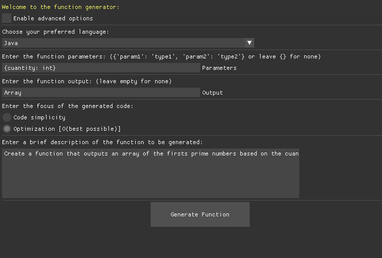

# Functions Generator 🚀

An AI-powered function generator that creates code functions in various programming languages using Google's Gemini AI.

## Features ✨

- **Multi-language support**: Generate functions in Python, JavaScript, C++, Java, and Rust
- **AI-powered**: Uses Google's Gemini API for intelligent code generation
- **Modern GUI**: Built with DearPyGui for a clean, responsive interface
- **Multiple themes**: Choose from Aqua, Dark, Dracula, and Terra themes
- **Customizable parameters**: Specify function parameters, output, and focus mode
- **Copy to clipboard**: Easy code copying functionality
- **Persistent settings**: Your preferences are saved automatically

## Screenshots 📸


*Main interface with function generation options*


*Available themes: Aqua, Dark, Dracula, and Terra*

## Installation 🛠️

### Prerequisites

- Python 3.7+
- Google Gemini API key

### Setup

1. **Clone the repository**
   ```bash
   git clone https://github.com/yourusername/functions-generator.git
   cd functions-generator
   ```

2. **Install dependencies**
   ```bash
   pip install -r requirements.txt
   ```

3. **Set up your Gemini API key**
   - Get your API key from [Google AI Studio](https://makersuite.google.com/app/apikey)
   - Run the application and click "Change Gemini's API Key" in the options
   - Enter your API key and save

4. **Run the application**
   ```bash
   cd src
   python main.py
   ```

## Usage 📋

### Basic Usage

1. **Select Programming Language**: Choose from Python, JavaScript, C++, Java, or Rust
2. **Define Parameters**: Enter function parameters in JSON format (e.g., `{"name": "string", "age": "number"}`)
3. **Specify Output**: Define the expected return type or leave empty
4. **Choose Focus**: Select between "Code simplicity" or "Optimization"
5. **Add Description**: Provide a brief description of what the function should do
6. **Generate**: Click "Generate Function" to create your code

### Advanced Options

Enable advanced options to access:
- **Theme Selection**: Switch between different visual themes
- **API Key Management**: Update your Gemini API key

### Example

**Input:**
- Language: `Python`
- Parameters: `{"numbers": "list", "threshold": "int"}`
- Output: `list`
- Focus: `Code simplicity`
- Description: `Filter numbers greater than threshold`

**Generated Output:**
```python
def filter_numbers(numbers, threshold):
    """Filter numbers greater than threshold"""
    return [num for num in numbers if num > threshold]
```

## Configuration ⚙️

The application automatically saves your preferences in `config.json`:

- Selected programming language
- Theme preference
- Advanced options state
- Function parameters and settings

## Themes 🎨

### Available Themes

- **Aqua**: Cool blue tones with a modern feel
- **Dark**: Classic dark theme for reduced eye strain
- **Dracula**: Popular purple-based theme
- **Terra**: Earth tones with green and brown pastels

## Project Structure 📁

```
functions-generator/
├── src/
│   ├── main.py              # Main application entry point
│   ├── .env                 # Environment variables (API key)
│   ├── config.json              # User preferences
│   ├── AI_Calls/
│   │   └── gemini.py        # Gemini API integration
│   ├── etc/
│   │   └── variables.py     # Configuration management
│   └── gui/
│       ├── themes.py        # UI themes
│       └── icons/           # Application icons
├── requirements.txt         # Python dependencies
└── README.md                # This file
```

## Dependencies 📦

- `dearpygui` - Modern GUI framework
- `python-dotenv` - Environment variable management
- `google-generativeai` - Google Gemini AI API
- `threading` - Async operations support

## API Integration 🔌

The application uses Google's Gemini API for code generation. You'll need:

1. A Google account
2. Access to Google AI Studio
3. A valid API key

The API key is stored securely in your local `.env` file and never shared.

## License 📄

This project is licensed under the GNU License - see the [LICENSE](LICENSE) file for details.

## Support 💬

If you encounter any issues or have questions:

- Open an issue on GitHub
- Check existing issues for solutions
- Provide detailed error messages and steps to reproduce


## Acknowledgments 🙏

- Google for providing the Gemini AI API
- DearPyGui team for the GUI framework
- Flaticon for the application icons

---

**Happy Coding!** 🎉

Made with ❤️ by Miguel